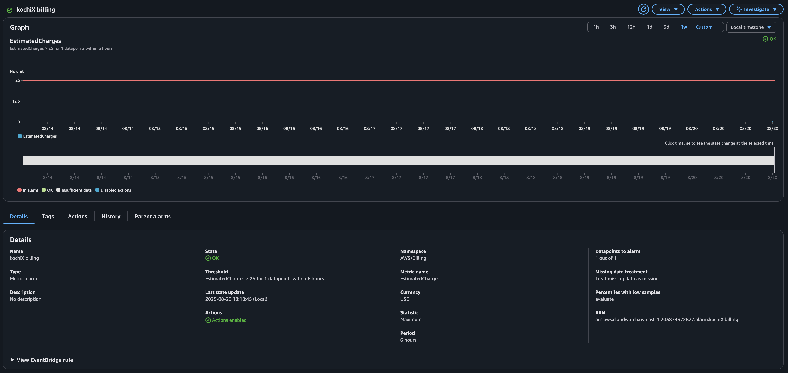
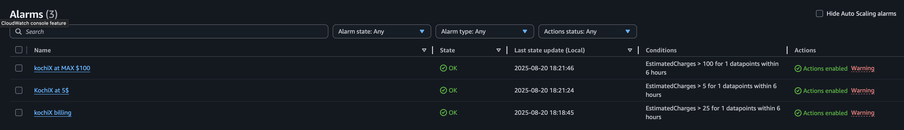

# aws-billing-alarms-kochiX  

AWS CloudWatch Billing Alarms configured at **$5, $25, and $100** to monitor and control cloud spending.  

---

## 📌 Project Overview  
This project demonstrates how to set up multiple **AWS Billing Alarms** using CloudWatch.  
The alarms are triggered at three thresholds to provide proactive cost monitoring:  

- **$5** → Early warning  
- **$25** → Moderate usage alert  
- **$100** → Critical spending alert  

---

## 📊 Billing Alarm at $25  
  

---

## 📈 Billing Alarm Overview  
  

---

## 🔄 Workflow Diagram  
The alarms follow a simple flow:  

  

---

## ✅ Key Learnings  
- Enabled AWS billing alerts via the Billing Console.  
- Configured CloudWatch alarms with custom thresholds.  
- Integrated optional SNS notifications for real-time alerts.  
- Gained hands-on experience in **cloud cost monitoring and management**.  

---

## 📚 Reference  
- [AWS Docs – Create a Billing Alarm](https://docs.aws.amazon.com/AmazonCloudWatch/latest/monitoring/monitor_estimated_charges_with_cloudwatch.html)  

